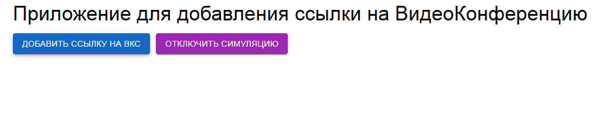
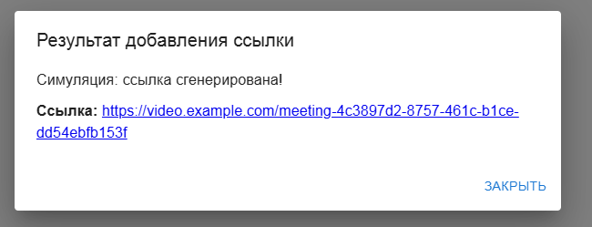

# LinkGenerator

## Приложение (черновой вариант)
- Приложение симулирует поведение Outlook и генерирует ссылку.
- Если симуляция отключена, то приложение выкинет ошибку.

## Стек Технологий
- React(useReducer), TS, Material UI в качестве верстки.
- Если симуляция отключена, то приложение выкинет ошибку.

### Инструкция по запуску
- Создайте папку для проекта и перейдите в неё.
- Склонируйте репозиторий `git@github.com:AplusO1/Link-Generator.git`
- Установите зависимости `npm install`
- Запускайте проект `npm run start`
---
